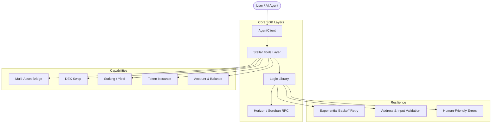

# Stellar AgentKit 🌟

> **Building the Future of Autonomous DeFi on Stellar**

[](LICENSE)
[](https://stellar.org)
[](#)

Stellar AgentKit is an industry-grade SDK and framework designed for developers building **Autonomous AI Agents** on the Stellar blockchain. It abstracts complex DeFi operations into a unified, resilient, and extensible interface.

---

## 🏗️ Technical Architecture



---

## ✨ Key Features

### 🛡️ Production-Ready Resilience

- **Exponential Backoff Retry**: Automatic recovery from network timeouts and rate limits.
- **Robust Validation**: Built-in Stellar address (G...) and secret (S...) validation.
- **Human-Friendly Errors**: Translates technical codes like `op_no_trust` into actionable advice.

### 🏦 Comprehensive DeFi Tools

- **Deep DEX Integration**: Standardized swaps and Liquidity Pool (LP) management.
- **Smart Staking**: Initialize, deposit, and claim rewards on Stellar smart contracts.
- **Cross-Chain Bridge**: Multi-asset bridging between Stellar and Ethereum via Allbridge.
- **Token Factory**: Launch custom Stellar assets with dual-safeguard protection.

### 🤖 Agent-First Design

- **Multi-Agent Orchestration**: Specialized "Analyst" and "Executor" hiyerarşisi desteği.
- **Autonomous UX**: Automatic trustline detection and creation before transactions.
- **LLM-Optimized**: Tool descriptions designed for seamless integration with GPT, Claude, and Gemini.

---

## 📦 Installation

```bash
npm i stellartools
```

---

## 🚀 Quick Start (Autonomous Example)

```typescript
import { AgentClient } from "stellartools";

const agent = new AgentClient({
  network: "testnet",
  publicKey: "G...",
});

// 1. Check Portfolio
const balances = await agent.getBalances();

// 2. Ensure Environment is Ready (Auto-Trustline)
await agent.ensureTrustline({
  assetCode: "USDC",
  assetIssuer: "G...",
});

// 3. Execute Resilient Swap
await agent.swap({
  to: "G...",
  buyA: true,
  out: "100",
  inMax: "110",
});
```

---

## 🌉 Multi-Asset Bridging (Dual-Safeguard)

Bridging on Mainnet requires explicit environment-level and code-level opt-ins for maximum safety.

```typescript
const agent = new AgentClient({
  network: "mainnet",
  allowMainnet: true, // Safeguard 1
  publicKey: process.env.STELLAR_PUBLIC_KEY,
});

// This also requires ALLOW_MAINNET_BRIDGE=true in .env
await agent.bridge({
  amount: "50",
  toAddress: "0x...",
  assetSymbol: "USDC", // Support for multiple assets
});
```

---

## 📊 Comparison: Why AgentKit?

| Feature         |  Standard SDK  |      Stellar AgentKit      |
| :-------------- | :------------: | :------------------------: |
| Retry Logic     |   ❌ Manual    | ✅ Automatic (Exponential) |
| Error Messages  |  ❌ Technical  |     ✅ Human-Readable      |
| Trustline Setup |   ❌ Manual    |    ✅ One-Click / Auto     |
| Multi-Chain     | ❌ Native Only |    ✅ Integrated Bridge    |
| Asset Issuance  |  ❌ Low-Level  |     ✅ Guarded Factory     |

---

## 📚 Documentation

- [Detailed API Reference](docs/api.md)
- [Staking Guide](docs/staking.md)
- [Example: Portfolio Rebalancer](examples/trading_bot.ts)
- [Example: Multi-Agent Orchestrator](examples/orchestrator.ts)

---

## 🛡️ Security

AgentKit implements a **Dual-Safeguard System** for all mainnet operations involving funds. Developers must consciously enable mainnet at both configuration (`AgentClient`) and environment (`.env`) levels.

---

## 📄 License

Stellar AgentKit is open-source software licensed under the **MIT License**.
